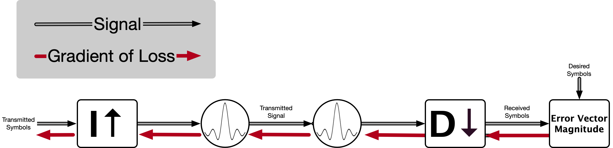
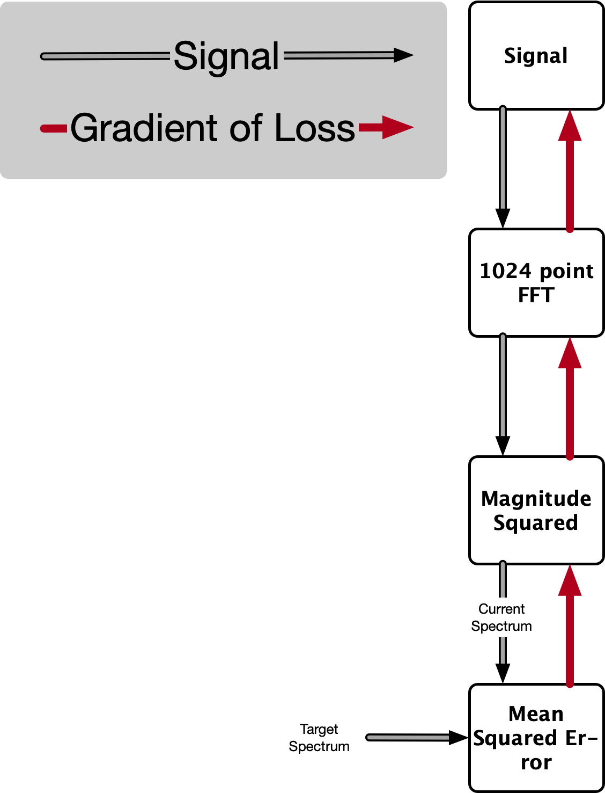

Radio Frequency Machine Learning (RFML) in PyTorch
==================================================

    The concept of deep learning has revitalized machine learning research in recent years.
    In particular, researchers have demonstrated the use of deep learning for a multitude of tasks in wireless communications, such as signal classification and cognitive radio.
    These technologies have been colloquially coined Radio Frequency Machine Learning (RFML) by the Defense Advanced Research Projects Agency (DARPA).
    This repository hosts two key components to enable you to further your RFML research: a library with PyTorch implementations of common RFML networks, wrappers for downloading and utilizing an open source signal classification dataset, and adversarial evasion and training methods along with multiple tutorial notebooks for signal classification, adversarial evasion, and adversarial training.

-------------------

.. raw:: html

    

|LICENSE_BADGE| |PYTHON_BADGE| |PYTORCH_BADGE| |BLACK_BADGE|

.. raw:: html

    

.. |LICENSE_BADGE| image:: https://img.shields.io/badge/License-BSD%203--Clause-blue.svg?style=plastic
    :alt: License
    :target: /LICENSE.rst
.. |PYTHON_BADGE| image:: https://img.shields.io/badge/Python-3-informational.svg?style=plastic
    :alt: Uses Python 3
.. |PYTORCH_BADGE| image:: https://img.shields.io/badge/Made%20With-PyTorch-informational.svg?style=plastic
    :alt: Deep Learning by PyTorch
    :target: https://pytorch.org
.. |BLACK_BADGE| image:: https://img.shields.io/badge/Code%20Style-Black-000000.svg?style=plastic
    :target: https://github.com/python/black

-------------------

.. contents:: **Table of Contents**

Highlights
##########

:code:`rfml.attack`
    Implementation of the Fast Gradient Sign Method (FGSM) and Projected Gradient Descent (PGD) that are aware of signal-to-perturbation ratios
:code:`rfml.data`
    Classes for creating datasets from raw-IQ samples, splitting amongst training/validation/test datasets while keeping classes and signal-to-noise ratios (SNR) balanced, and converting into a PyTorch :code:`TensorDataset`
:code:`rfml.data.converters`
    Wrappers to load open source datasets (including downloading them from the internet if necessary) from DeepSig, Inc
:code:`rfml.nn.eval`
    Compute Top-K accuracy (overall and vs SNR) and confusion matrices from the models and datasets contained in this library
:code:`rfml.nn.model`
    Implementations of state of the art signal classification deep neural networks (DNNs) in PyTorch
:code:`rfml.nn.train`
    Implementation of standard training and adversarial training algorithms for classification problems in PyTorch
:code:`rfml.ptradio`
    PyTorch implementations of linearly modulated modems (such as PSK, QAM, etc) and simple channel models

Quick Start
###########

Installation
------------

The :code:`rfml` library can be installed directly from :code:`pip` (for Python >= 3.5).

.. code:: bash

    pip install git+https://github.com/brysef/rfml.git@1.0.1

If you plan to directly edit the underlying library then you can install the library as editable after cloning this repository.

.. code:: bash

    git clone git@github.com:brysef/rfml.git # OR https://github.com/brysef/rfml.git
    pip install --user -e rfml/

Signal Classification (AMC)
---------------------------

.. raw:: html

    

    
Click to Expand

The following code (located at :code:`examples/signal_classification.py`) will:

- Download the RML2016.10a Dataset from deepsig.io/datasets
- Load the dataset into a PyTorch format with categorical labels
- Create a Convolutional Neural Network model with PyTorch
- Train the model to perform modulation classification
- Evaluate the model on the test set in terms of overall accuracy, accuracy vs SNR, and a confusion matrix amongst classes
- Save the model weights for later use

.. code:: python
    :number-lines:

    from rfml.data import build_dataset
    from rfml.nn.eval import (
        compute_accuracy,
        compute_accuracy_on_cross_sections,
        compute_confusion,
    )
    from rfml.nn.model import build_model
    from rfml.nn.train import build_trainer, PrintingTrainingListener

    train, val, test, le = build_dataset(dataset_name="RML2016.10a")
    model = build_model(model_name="CNN", input_samples=128, n_classes=len(le))
    trainer = build_trainer(
        strategy="standard", max_epochs=3, gpu=True
    )  # Note: Disable the GPU here if you do not have one
    trainer.register_listener(PrintingTrainingListener())
    trainer(model=model, training=train, validation=val, le=le)
    acc = compute_accuracy(model=model, data=test, le=le)
    acc_vs_snr, snr = compute_accuracy_on_cross_sections(
        model=model, data=test, le=le, column="SNR"
    )
    cmn = compute_confusion(model=model, data=test, le=le)

    # Calls to a plotting function could be inserted here
    # For simplicity, this script only prints the contents as an example
    print("===============================")
    print("Overall Testing Accuracy: {:.4f}".format(acc))
    print("SNR (dB)\tAccuracy (%)")
    print("===============================")
    for acc, snr in zip(acc_vs_snr, snr):
        print("{snr:d}\t{acc:0.1f}".format(snr=snr, acc=acc * 100))
    print("===============================")
    print("Confusion Matrix:")
    print(cmn)

    model.save("cnn.pt")

Running the above code will produce an output similar to the following.
Additionally, the weights file will be saved off (:code:`cnn.py`) along with a local copy of the RML2016.10a dataset (:code:`RML2016.10a.*`).

.. code:: bash

    > python3 signal_classification.py
    .../rfml/data/converters/rml_2016.py:42: UserWarning:
    About to attempt downloading the RML2016.10A dataset from deepsig.io/datasets.
    Depending on your network connection, this process can be slow and error prone.  Any
    errors raised during network operations are not silenced and will therefore cause your
    code to crash.  If you require robustness in your experimentation, you should manually
    download the file locally and pass the file path to the load_RML201610a_dataset
    function.

    Further, this dataset is provided by DeepSig Inc. under Creative Commons Attribution
    - NonCommercial - ShareAlike 4.0 License (CC BY-NC-SA 4.0).  By calling this function,
    you agree to that license -- If an alternative license is needed, please contact DeepSig
    Inc. at info@deepsig.io

    warn(self.WARNING_MSG)

    Epoch 0 completed!
                    -Mean Training Loss: 1.367
                    -Mean Validation Loss: 1.226
    Epoch 1 completed!
                    -Mean Training Loss: 1.185
                    -Mean Validation Loss: 1.180
    Epoch 2 completed!
                    -Mean Training Loss: 1.128
                    -Mean Validation Loss: 1.158
    Training has Completed:

    =======================
            Best Validation Loss: 1.158
            Best Epoch: 2
            Total Epochs: 2
    =======================
    ===============================
    Overall Testing Accuracy: 0.6024
    SNR (dB)        Accuracy (%)
    ===============================
    -4      72.3
    16      82.8
    -12     25.2
    10      84.0
    -8      49.8
    -10     34.8
    -14     19.0
    18      83.0
    -6      63.5
    6       83.4
    -20     12.0
    12      82.2
    14      82.5
    2       81.3
    -2      77.6
    -16     13.4
    -18     12.3
    4       81.6
    0       80.9
    8       83.3
    ===============================
    Confusion Matrix:
    ...

.. raw:: html

    

Evading Signal Classification (FGSM)
------------------------------------

.. raw:: html

    

    
Click to Expand

The following code (located at :code:`examples/adversarial_evasion.py`) will:

- Download the RML2016.10a Dataset from deepsig.io/datasets
- Load the dataset into a PyTorch format with categorical labels and only keep high SNR samples
- Create a Convolutional Neural Network model with PyTorch
- Load pre-trained weights (see `Signal Classification (AMC)`_)
- Evaluate the model on the dataset with no adversarial evasion for a baseline
- Perform an FGSM attack with a signal-to-perturbation ratio of 10 dB

Note that its likely that this script would evaluate the network on data it also used for training and that is certainly not desired.
This script is merely meant to serve as an easy example and shouldn't be directly used for evaluation.

.. code:: python
    :number-lines:

    from rfml.attack import fgsm
    from rfml.data import build_dataset
    from rfml.nn.eval import compute_accuracy
    from rfml.nn.model import build_model

    from torch.utils.data import DataLoader

    _, _, test, le = build_dataset(dataset_name="RML2016.10a", test_pct=0.9)
    mask = test.df["SNR"] >= 18
    model = build_model(model_name="CNN", input_samples=128, n_classes=len(le))
    model.load("cnn.pt")

    acc = compute_accuracy(model=model, data=test, le=le, mask=mask)
    print("Normal (no attack) Accuracy on Dataset: {:.3f}".format(acc))

    spr = 10  # dB
    right = 0
    total = 0
    dl = DataLoader(test.as_torch(le=le, mask=mask), shuffle=True, batch_size=512)
    for x, y in dl:
        adv_x = fgsm(x, y, spr=spr, input_size=128, sps=8, net=model)

        predictions = model.predict(adv_x)
        right += (predictions == y).sum().item()
        total += len(y)

    adv_acc = float(right) / total
    print("Adversarial Accuracy with SPR of {} dB attack: {:.3f}".format(spr, adv_acc))
    print("FGSM Degraded Model Accuracy by {:.3f}".format(acc - adv_acc))

Running the above code will produce an output similar to the following.

.. code:: bash

    > python3 examples/adversarial_evasion.py
        Normal (no attack) Accuracy on Dataset: 0.831
        Adversarial Accuracy with SPR of 10 dB attack: 0.092
        FGSM Degraded Model Accuracy by 0.740

.. raw:: html

    

PyTorch Implementation of Linear Modulations
--------------------------------------------

.. raw:: html

    

    
Click to Expand

The following code (located at :code:`examples/pt_modem.py`) will do the following:

- Generate a random bit stream
- Modulate that bit stream using a PyTorch implementation of a linear modem (with a symbol mapping, upsampling, and pulse shaping)
- Corrupt the signal using AWGN generated by a PyTorch module
- Demodulate the bit stream back using a PyTorch implementation (with match filtering, downsampling, and a hard decision on symbol unmapping)
- Compute the bit error rate

While it is a simplistic example, the individual pieces (transmit, receive, and channel) can all be reused for your specific application.

.. code:: python
    :number-lines:

    from rfml.ptradio import AWGN, Transmitter, Receiver, theoreticalBER

    import numpy as np

    modulation = "BPSK"  # could be QPSK, 8PSK, QAM16, QAM64
    tx = Transmitter(modulation=modulation)
    channel = AWGN()
    rx = Receiver(modulation=modulation)

    n_symbols = int(10e3)
    n_bits = int(tx.symbol_encoder.get_bps() * n_symbols)
    snrs = list(range(0, 8))
    n_trials = 10

    for snr in range(0, 8):
        channel.set_snr(snr)
        n_errors = 0

        for _ in range(n_trials):
            tx_bits = np.random.randint(low=0, high=2, size=n_bits)
            tx_iq = tx.modulate(bits=tx_bits)

            rx_iq = channel(tx_iq)

            rx_bits = rx.demodulate(iq=rx_iq)
            rx_bits = np.array(rx_bits)

            n_errors += np.sum(np.abs(tx_bits - rx_bits))

        ber = float(n_errors) / float(n_bits * n_trials)
        theory = theoreticalBER(modulation=modulation, snr=snr)

        print(
            "BER={:.3e}, "
            "theory={:.3e}, "
            "|diff|={:.3e}, "
            "SNR={:d}, "
            "modulation={}".format(ber, theory, np.abs(ber - theory), snr, modulation)
        )

Running the above code will produce an output similar to the following.

.. code:: bash

    > python3 examples/pt_modem.py
        BER=7.763e-02, theory=7.865e-02, |diff|=1.020e-03, SNR=0, modulation=BPSK
        BER=5.502e-02, theory=5.628e-02, |diff|=1.262e-03, SNR=1, modulation=BPSK
        BER=3.740e-02, theory=3.751e-02, |diff|=1.060e-04, SNR=2, modulation=BPSK
        BER=2.340e-02, theory=2.288e-02, |diff|=5.220e-04, SNR=3, modulation=BPSK
        BER=1.269e-02, theory=1.250e-02, |diff|=1.890e-04, SNR=4, modulation=BPSK
        BER=6.500e-03, theory=5.954e-03, |diff|=5.461e-04, SNR=5, modulation=BPSK
        BER=2.250e-03, theory=2.388e-03, |diff|=1.383e-04, SNR=6, modulation=BPSK
        BER=8.000e-04, theory=7.727e-04, |diff|=2.733e-05, SNR=7, modulation=BPSK

.. raw:: html

    

Using EVM as a Loss Function
----------------------------

.. raw:: html

    

    
Click to Expand

The Error Vector Magnitude (EVM) of the symbols can be used as a loss function as well.
The following code snippet (located at :code:`examples/evm_loss.py`) presents a, silly, minimalist example of its use.
In this code, a transmit/receive chain is constructed (see `PyTorch Implementation of Linear Modulations`_) and the transmitted symbols are *learned* from some target received symbols.

.. code:: python
    :number-lines:

    from rfml.ptradio import RRC, Upsample, Downsample
    from rfml.ptradio.modem import _qpsk_constellation
    from rfml.nn.F import evm

    import numpy as np

    import torch
    from torch.nn import Sequential, Parameter
    from torch.autograd import Variable
    from torch.optim import SGD

    n_symbols = 32
    indices = np.random.randint(low=0, high=4, size=n_symbols)
    target_symbols = np.array([_qpsk_constellation[i] for i in indices])
    target_symbols = np.stack((target_symbols.real, target_symbols.imag))
    _target_symbols = torch.from_numpy(
        target_symbols[np.newaxis, np.newaxis, ::].astype(np.float32)
    )

    mean = torch.zeros((1, 1, 2, _target_symbols.shape[3]))
    std = torch.ones((1, 1, 2, _target_symbols.shape[3]))
    tx_symbols = torch.nn.Parameter(torch.normal(mean, std))

    optimizer = SGD((tx_symbols,), lr=10e-2, momentum=0.9)

    tx_chain = Sequential(
        Upsample(i=8), RRC(alpha=0.35, sps=8, filter_span=8, add_pad=True)
    )
    rx_chain = Sequential(
        RRC(alpha=0.35, sps=8, filter_span=8, add_pad=False), Downsample(offset=8 * 8, d=8)
    )

    n_epochs = 151
    for i in range(n_epochs):
        tx_signal = tx_chain(tx_symbols)
        rx_symbols = rx_chain(tx_signal)
        loss = torch.mean(evm(rx_symbols, _target_symbols))

        if i % 15 == 0:
            print("Loss @ epoch {}: {:3f}".format(i, loss))

        loss.backward()
        optimizer.step()
        tx_symbols.grad.zero_()

The code may be better understood through a diagram.

If the above code is executed, an output similar to the following should be observed.

.. code:: bash

    > python3 examples/evm_loss.py
        Loss @ epoch 0: 1.700565
        Loss @ epoch 15: 1.455332
        Loss @ epoch 30: 1.062061
        Loss @ epoch 45: 0.700792
        Loss @ epoch 60: 0.422401
        Loss @ epoch 75: 0.220447
        Loss @ epoch 90: 0.102916
        Loss @ epoch 105: 0.044921
        Loss @ epoch 120: 0.021536
        Loss @ epoch 135: 0.006125
        Loss @ epoch 150: 0.004482

Which may also be better understood through an animation.

.. image:: notebooks/_fig/symbolerror.gif
   :height: 100px
   :width: 200px
   :scale: 50%
   :alt: Animation of utilizing symbol (EVM) loss
   :align: center

.. raw:: html

    

Spectral Mask as a Loss Function
--------------------------------

.. raw:: html

    

    
Click to Expand

Nearly all communications systems are frequency limited, therefore, it can be helpful to have a component of the loss function which penalizes the use of spectrum.
The following simple example (located at :code:`examples/spectral_loss.py`) demonstrates a *filtering* of a signal to adhere to a spectral mask.
By itself, it isn't useful as the performance is extremely subpar to a standard digital filter; however, it can be incorportated into a larger machine learning workflow.

.. code:: python
    :number-lines:

    from rfml.nn.F import psd
    from rfml.ptradio import RRC

    import numpy as np

    import torch
    from torch.nn import Parameter
    from torch.optim import SGD

    n_time = 1024

    # Create a white gaussian noise signal -- therefore ~ flat across frequency
    mean = torch.zeros((1, 1, 2, n_time))
    std = torch.ones((1, 1, 2, n_time)) / 25.0
    signal = torch.nn.Parameter(torch.normal(mean, std))
    t = np.arange(n_time)

    # Define our "target" PSD profile to be the spectrum of the root raised cosine
    rrc = RRC()
    impulse = rrc.impulse_response
    # The impulse response is real valued so we'll make it "complex" by just adding
    # another dimension in for IQ and setting the imaginary portion to 0
    impulse = torch.cat((impulse, impulse), dim=2)
    impulse[:, :, 1, :] = 0.0

    # In order to match dimensions with our desired frequency resolution by
    # setting n_time to be the FFT length -- we must pad with some zeros
    _to_pad = torch.zeros(
        (impulse.shape[0], impulse.shape[1], impulse.shape[2], n_time - impulse.shape[3])
    )
    impulse = torch.cat((impulse, _to_pad), dim=3)

    target_psd = psd(impulse)

    optimizer = SGD((signal,), lr=50e-4, momentum=0.9)

    n_epochs = 151
    for i in range(n_epochs):
        cur_psd = psd(signal)
        loss = torch.mean((cur_psd - target_psd) ** 2)

        if i % 15 == 0:
            print("Loss @ epoch {}: {:3f}".format(i, loss))

        loss.backward()
        optimizer.step()
        signal.grad.zero_()

It may be easier to understand the above code with a diagram.

If the example is ran, an output similar to the following will be displayed.

.. code:: bash

    > python3 examples/spectral_loss.py
        Loss @ epoch 0: 20.610109
        Loss @ epoch 15: 1.159350
        Loss @ epoch 30: 0.206273
        Loss @ epoch 45: 0.039206
        Loss @ epoch 60: 0.007379
        Loss @ epoch 75: 0.001740
        Loss @ epoch 90: 0.000586
        Loss @ epoch 105: 0.000301
        Loss @ epoch 120: 0.000195
        Loss @ epoch 135: 0.000145
        Loss @ epoch 150: 0.000117

Which, again, may be more easily understood through an animation.

.. image:: notebooks/_fig/spectral.gif
   :height: 200px
   :width: 100px
   :scale: 50%
   :alt: Animation of utilizing spectral loss
   :align: center

Clearly, the loss function does a great job at initially killing the out of band energy to comply with the provided spectral mask, however, it only achieves ~20dB of attenuation whereas a digital filter could achieve much greater out of band attenuation.

.. raw:: html

    

Executing Unit Tests
####################
From the root folder of the repository.

.. code:: bash

    python3 -m pytest

Documentation
#############
The documentation is a relatively simplistic Sphinx API rendering hosted within the repository by GitHub pages.
It can be accessed at `brysef.github.io/rfml <https://www.brysef.github.io/rfml/>`_.

Tutorial
########

This code was released in support of a tutorial offered at MILCOM 2019 (`Adversarial Radio Frequency Machine Learning (RFML) with PyTorch <https://events.afcea.org/MILCOM19/Public/SessionDetails.aspx?FromPage=Sessions.aspx&SessionID=7815&SessionDateID=564>`_).
While the code contained in the library can be applied more broadly, the tutorial was focused on adversarial evasion attacks and defenses on deep learning enabled signal classification systems.
The learning objectives and course outline of that tutorial are provided below.
Of particular interest, three Jupyter Notebooks are included that demonstrate how to: train an Automatic Modulation Classification Neural Network, evade signal classification with the Fast Gradient Sign Method, and perform adversarial training.

Learning Objectives
-------------------
Through this tutorial, the attendee will be introduced to the following concepts:

1.  Applications of RFML

2.  The PyTorch toolkit for developing RFML solutions

    - (Hands-On Exercise) Train, validate, and test a simple neural network for spectrum sensing
    - Advanced PyTorch concepts (such as custom loss functions and modules to support advanced digital signal processing functions)

3.  Adversarial machine learning applied to RFML

    - Overview of current state-of-the-art in adversarial RFML
    - (Hands-On Exercise) Develop an adversarial evasion attack against a spectrum sensing network (created by the attendee) using the well-known Fast Gradient Sign Method (FGSM) algorithm
    - Overview of hardening techniques against adversarial RFML
    - (Hands-On Exercise) Utilize adversarial training to harden a RFML model

Format
------
The primary objective of the tutorial is for the attendee to be hands-on with the code.
Therefore, while a lot of information is presented in slide format, the core of the tutorial is code execution through prepared `Jupyter Notebooks <https://jupyter.org>`_ executed in `Google Colaboratory <https://colab.research.google.com>`_.
In the modules listed below, you can click on the *solutions* notebook to view a pre-ran Jupyter Notebook that is rendered by GitHub, or, click on *Open in Colab* to open an executable version in Google Colaboratory.
Note that when opening Google Colaboratory you should either enable the GPU Hardware Accelerator (`click here for how <https://jovianlin.io/pytorch-with-gpu-in-google-colab/>`_) or disable the GPU flag in the notebooks (this will make execution very slow).

Modules
-------
.. list-table::
    :widths: 5, 5, 30, 20
    :align: center
    :header-rows: 1

    * - #
      - Time
      - Description
      - Notes/Solutions/Exercises
    * - 0
      - 10m
      - **Introduction:** |br| Provide an overview of RFML with a focus on signal classification.
      -
    * - 1
      - 10m
      - **Tutorial Objectives and Software Tools:** |br| Describe the skills that will be learned in this tutorial and introduce the format and software tools utilized for the hands-on exercises.
      -
    * - 2
      - 20m
      - **Train/Evaluate a DNN for AMC:** |br| Train and validate a DNN using a static dataset of raw IQ data to perform an automatic modulation classification (AMC) task. After training, the performance of the network will be evaluated as a function of SNR and an averaged confusion matrix of all possible classes.
      - |SOLUTIONS_TRAIN| |br| |COLAB_TRAIN|
    * - 3
      - 15m
      - **Adversarial RF Machine Learning:** |br| Provide an overview of adversarial machine learning techniques and how they uniquely apply to RFML.  In particular, focus on adversarial evasion attacks and the well-known FGSM algorithm.
      -
    * - 4
      - 20m
      - **Evade Signal Classification with FGSM:** |br| Develop a white-box, digital, adversarial evasion attack against a trained AMC DNN using the FGSM algorithm.
      - |SOLUTIONS_EVADE| |br| |COLAB_EVADE|
    * - 5
      - 15m
      - **Physical Adversarial RF Machine Learning:** |br| Many adversarial ML techniques in the literature focus on attacks that have digital access to the classifier input; however, the primary vulnerability of RFML is to physical attacks, which are transmitted over-the-air and thus perturbations are subject to natural noise and impact their intended receiver.
      -
    * -
      -
      - **Break**
      -
    * - 6
      - 15m
      - **Hardening RFML Against Adversarial Evasion:** |br| Provide an overview of techniques by which to harden deep learning solutions against adversarial evasion attacks.  In particular, study the unique defense techniques that have been proposed in RFML for both detecting adversarial examples and being robust to those adversarial examples (by still correctly classifiying them).
      -
    * - 7
      - 20m
      - **Adversarial Training:** |br| Train a DNN, with portions of the training inputs being adversarial examples generated from FGSM on the fly, in order to gain more robustness against an FGSM attack.
      - |SOLUTIONS_ROBUST| |br| |COLAB_ROBUST|
    * - 9
      - 10m
      - **Conclusion:** |br| Summary of current state of adversarial RFML, the proposed next steps for research, and immediate actions to ensure robust RFML devices.
      -
    * - 10
      - 20m
      - **Advanced Topics in PyTorch:** |br| "Expert" filters, channel models, and custom loss functions for RF.
      -
    * -
      -
      - **Bibliography:** |br| Citations used in the slides and code.
      -

.. TODO -- could include the slides here
.. |NOTES_INTRO| image:: https://img.shields.io/badge/Open-Notes-lightgrey.svg?style=plastic
    :alt: Open Notes: Introduction
    :target: notes/module0_introduction.rst
.. |NOTES_OBJECTIVES| image:: https://img.shields.io/badge/Open-Notes-lightgrey.svg?style=plastic
    :alt: Open Notes: Tutorial Objectives and Software Tools
    :target: notes/module1_objectivesandtools.rst
.. |NOTES_ADVERSARIAL| image:: https://img.shields.io/badge/Open-Notes-lightgrey.svg?style=plastic
    :alt: Open Notes: Adversarial RF Machine Learning
    :target: notes/module3_advdersarialrfml.rst
.. |NOTES_PHYSICAL| image:: https://img.shields.io/badge/Open-Notes-lightgrey.svg?style=plastic
    :alt: Open Notes: Physical Adversarial RF Machine Learning
    :target: notes/module3_advdersarialrfml.rst
.. |NOTES_HARDENING| image:: https://img.shields.io/badge/Open-Notes-lightgrey.svg?style=plastic
    :alt: Open Notes: Hardening RFML Against Adversarial Evasion
    :target: notes/module5_hardening.rst
.. |NOTES_CONCLUSION| image:: https://img.shields.io/badge/Open-Notes-lightgrey.svg?style=plastic
    :alt: Open Notes: Conclusion of Adversarial RFML
    :target: notes/module5_hardening.rst
.. |NOTES_ADVANCED| image:: https://img.shields.io/badge/Open-Notes-lightgrey.svg?style=plastic
    :alt: Open Notes: Advanced RFML Modules in PyTorch
    :target: notes/module5_hardening.rst

.. |SOLUTIONS_TRAIN| image:: https://img.shields.io/badge/Solutions-Notebook-informational.svg?style=plastic&logo=jupyter
    :alt: Open Solutions Notebook: Train/Evaluate a DNN for AMC
    :target: notebooks/module2_solutions.ipynb
.. |SOLUTIONS_EVADE| image:: https://img.shields.io/badge/Solutions-Notebook-informational.svg?style=plastic&logo=jupyter
    :alt: Open Solutions Notebook: Evade Signal Classification with FGSM
    :target: notebooks/module4_solutions.ipynb
.. |SOLUTIONS_ROBUST| image:: https://img.shields.io/badge/Solutions-Notebook-informational.svg?style=plastic&logo=jupyter
    :alt: Open Solutions Notebook: Adversarial Training
    :target: notebooks/module6_solutions.ipynb

.. |COLAB_TRAIN| image:: https://colab.research.google.com/assets/colab-badge.svg
    :alt: Open Notebook in Colab: Train/Evaluate a DNN for AMC
    :target: https://colab.research.google.com/github/brysef/rfml/blob/master/notebooks/module2_empty.ipynb
.. |COLAB_EVADE| image:: https://colab.research.google.com/assets/colab-badge.svg
    :alt: Open Notebook in Colab: Evade Signal Classification with FGSM
    :target: https://colab.research.google.com/github/brysef/rfml/blob/master/notebooks/module4_empty.ipynb
.. |COLAB_ROBUST| image:: https://colab.research.google.com/assets/colab-badge.svg
    :alt: Open Notebook in Colab: Adversarial Training
    :target: https://colab.research.google.com/github/brysef/rfml/blob/master/notebooks/module6_empty.ipynb

Contributing
############
If you find any errors, feel free to open an issue; though I can't guarantee how quickly it will be looked at.
Pull requests are accepted though 😃!
There isn't an extensive contribution guideline, but, please follow the `GitHub Flow <https://guides.github.com/introduction/flow/>`_.

In particular, ensure that you've:

- written a passing unit test (that would have failed before)
- formatted the code with `black <https://black.readthedocs.io/en/stable/>`_
- re-built the documentation (if applicable)
- adequately described why the change was needed (if a bug) or what the change does (if a new feature)

If you've open sourced your own work in machine learning for wireless communications, feel free to drop me a note to be added to the related projects!

Related GitHub Projects
#######################

- `MeysamSadeghi/Security of DL in Wireless <https://github.com/meysamsadeghi/Security-and-Robustness-of-Deep-Learning-in-Wireless-Communication-Systems>`_: Attacks on Physical Layer Auto-Encoders in TensorFlow
- `RadioML/Examples <https://github.com/radioML/examples>`_: Automatic Modulation Classification using Keras
- `RadioML/Dataset <https://github.com/radioML/dataset>`_: Recreate the RML Synthetic Datasets using GNU Radio
- `immortal3/AutoEncoder Communication <https://github.com/immortal3/AutoEncoder-Based-Communication-System>`_: TensorFlow implementation of "An Introduction to Deep Learning for the Physical Layer"
- `Tensorflow/Cleverhans <https://github.com/tensorflow/cleverhans>`_: Library for adversarial machine learning attacks and defenses with support for Tensorflow (support for other frameworks coming soon) -- This repository also contains tutorials for adversarial machine learning
- `BethgeLab/Foolbox <https://github.com/bethgelab/foolbox>`_: Library for adversarial machine learning attacks with support for PyTorch, Keras, and TensorFlow
- `MadryLab/robustness <https://github.com/MadryLab/robustness>`_: Adversarial training library built with PyTorch.
- `FastAI <https://github.com/fastai/fastai>`_: An extensive deep learning library along with tutorials built on top of PyTorch
- `PyTorch <https://pytorch.org/tutorials/>`_: The PyTorch library itself comes with excellent documentation and tutorials

License
#######
This project is licensed under the BSD 3-Clause License -- See `LICENSE.rst <LICENSE.rst>`_ for more details.

Citing this Repository
######################
This repository contains implementations of other folk's algorithms (e.g. adversarial attacks, neural network architectures, dataset wrappers, etc.) and therefore, whenever those algorithms are used, their respective works **must** be cited.
The relevant citations for their works have been provided in the *docstrings* when needed.
Since this repository isn't the *official* code for any publication, you take responsibility for the *correctness* of the implementations (although we've made every effort to ensure that the code is well tested).

If you find this code useful for your research, please consider referencing it in your work so that others are aware.
This repository isn't citable (since that requires `archiving and creating a DOI <https://guides.github.com/activities/citable-code/>`_), so a simple footnote would be the best way to reference this repository.

.. code:: latex

    \footnote{Code is available at \textit{github.com/brysef/rfml}}

If your work specifically revolves around adversarial machine learning for wireless communications, consider citing my journal publication (on FGSM physical adversarial attacks for wireless communications) or MILCOM conference paper (on adding communications loss to adversarial attacks).

.. code:: latex

    @article{Flowers2019a,
            author = {B. {Flowers} and R. M. {Buehrer} and W. C. {Headley}},
            doi = {10.1109/TIFS.2019.2934069},
            issn = {1556-6013},
            journal = {IEEE Transactions on Information Forensics and Security},
            month = {},
            number = {},
            pages = {1-1},
            title = {Evaluating Adversarial Evasion Attacks in the Context of Wireless Communications},
            volume = {},
            year = {2019}
    }
    @inproceedings{mine:Flowers2019b,
        author = {Bryse Flowers and R. Michael Buehrer and William C. Headley},
        booktitle = {Military Commun. Conf.},
        publisher = {IEEE},
        title = {Communications Aware Adversarial Residual Networks},
        type = {Conference Proceedings},
        year = {2019}
    }

Authors
#######

.. list-table::
    :widths: 30, 60, 10
    :align: center

    * - **Bryse Flowers**
      - PhD student at UCSD
      - bflowers@ucsd.edu
    * - **William C. Headley**
      - Associate Director of Electronic Systems Laboratory, Hume Center / Research Assistant Professor ECE Virginia Tech
      - cheadley@vt.edu

Numerous others have generously contributed to this work -- see `CONTRIBUTORS.rst <CONTRIBUTORS.rst>`_ for more details.

.. |br| raw:: html

     